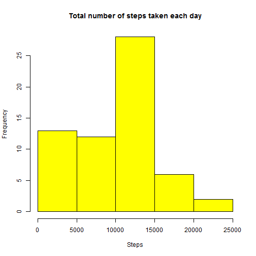

## Loading and preprocessing the data

```r
require(dplyr)
require(lattice)
filename <- "activity.zip"
if (!file.exists(filename)){
  fileURL <- "https://d396qusza40orc.cloudfront.net/repdata%2Fdata%2Factivity.zip"
  download.file(fileURL, filename)
}
unzip("activity.zip")
activity_data <- read.csv("activity.csv") 
```

## What is mean total number of steps taken per day?
1. Calculate the total number of steps taken per day

```r
steps_taken <- activity_data %>% group_by(date) %>% summarise(steps = sum(steps,na.rm=TRUE))
```

2. Make a histogram of the total number of steps taken each day

```r
hist(steps_taken$steps, main="Total number of steps taken each day", xlab="Steps",col="yellow")
```


3. Calculate and report the mean and median of the total number of steps taken per day

```r
abline(v=mean(steps_taken$steps),col="purple")
```

```
## Error in int_abline(a = a, b = b, h = h, v = v, untf = untf, ...): plot.new has not been called yet
```

```r
abline(v=median(steps_taken$steps),col="red")
```

```
## Error in int_abline(a = a, b = b, h = h, v = v, untf = untf, ...): plot.new has not been called yet
```

```r
legend("right",
	legend=c(paste("Mean = ",trunc(mean(steps_taken$steps))), paste("Median = ", trunc(median(steps_taken$steps)))),
	col=c("purple","red"),
	text.col=c("purple","red"),
	cex=.8,
	lwd=c(1,1,1))
```

```
## Error in strwidth(legend, units = "user", cex = cex, font = text.font): plot.new has not been called yet
```

## What is the average daily activity pattern?
1. Make a time series plot (i.e. type = "l") of the 5-minute interval (x-axis) and the average number of steps taken, averaged across all days (y-axis)

```r
steps_interval <- activity_data %>% group_by(interval) %>% summarise(steps = mean(steps,na.rm=TRUE))
plot(x=steps_interval$interval,y=steps_interval$steps,type="l",xlab="5-minute interval",ylab="Average number of steps taken")
```


2. Which 5-minute interval, on average across all the days in the dataset, contains the maximum number of steps?

```r
max_steps_interval <- steps_interval$interval[which.max(steps_interval$steps)]
max_steps <- steps_interval$steps[which.max(steps_interval$steps)]
text(max_steps_interval, max_steps, labels=c(paste("Max step of ",round(max_steps,digits=2)," at interval ",max_steps_interval)), cex= 0.7)
```

```
## Error in text.default(max_steps_interval, max_steps, labels = c(paste("Max step of ", : plot.new has not been called yet
```

## Imputing missing values
1. Calculate and report the total number of missing values in the dataset (i.e. the total number of rows with NAs)

```r
sum(is.na(activity_data$steps))
```

```
## [1] 2304
```

2. Devise a strategy for filling in all of the missing values in the dataset. **Mean for that day to be used to fill the NA data.**
3. Create a new dataset that is equal to the original dataset but with the missing data filled in.

```r
mean_steps_taken <- activity_data %>% group_by(date) %>% summarise(mean_steps = mean(ifelse(is.na(steps),0,steps)))
activity_data_new <- activity_data
activity_data_new <- activity_data_new %>% left_join(mean_steps_taken,by=c("date")) %>% mutate(steps=ifelse(is.na(steps),mean_steps,steps)) %>% select(steps,date,interval)
```

4. Make a histogram of the total number of steps taken each day and Calculate and report the mean and median total number of steps taken per day.

```r
steps_taken_new <- activity_data_new %>% group_by(date) %>% summarise(steps = sum(steps,na.rm=TRUE))
hist(steps_taken_new$steps, main="Total number of steps taken each day", xlab="Steps",col="yellow")
abline(v=mean(steps_taken_new$steps),col="purple")
abline(v=median(steps_taken_new$steps),col="red")
legend("right",
	legend=c(paste("Mean = ",trunc(mean(steps_taken_new$steps))), paste("Median = ", trunc(median(steps_taken_new$steps)))),
	col=c("purple","red"),
	text.col=c("purple","red"),
	cex=.8,
	lwd=c(1,1,1))
```


5. Do these values differ from the estimates from the first part of the assignment? What is the impact of imputing missing data on the estimates of the total daily number of steps?
There is no impact of the missing data on the estimates of total steps and mean/median. As I have used mean steps of that day to replace the NA values, it seems that the day containing the NA values do not contain any valid values; thus the days containg NA value generates zero steps even after replacing them with mean of that day(0).

## Are there differences in activity patterns between weekdays and weekends?
1. Create a new factor variable in the dataset with two levels – "weekday" and "weekend" indicating whether a given date is a weekday or weekend day.

```r
activity_data_daysofweek <- activity_data %>% mutate(type_of_day = factor(ifelse(weekdays(as.Date(date)) %in% c("Saturday","Sunday"),"Weekend","Weekday"),c("Weekend","Weekday")))
```

2. Make a panel plot containing a time series plot (i.e. type = "l") of the 5-minute interval (x-axis) and the average number of steps taken, averaged across all weekday days or weekend days (y-axis).

```r
steps_interval_daysofweek <- activity_data_daysofweek %>% group_by(interval,type_of_day) %>% summarise(steps = mean(steps,na.rm=TRUE))
xyplot(steps~interval | type_of_day, data=activity_data_daysofweek,type="l",xlab="5-minute interval",ylab="Average number of steps taken",layout = c(1,2))
```


